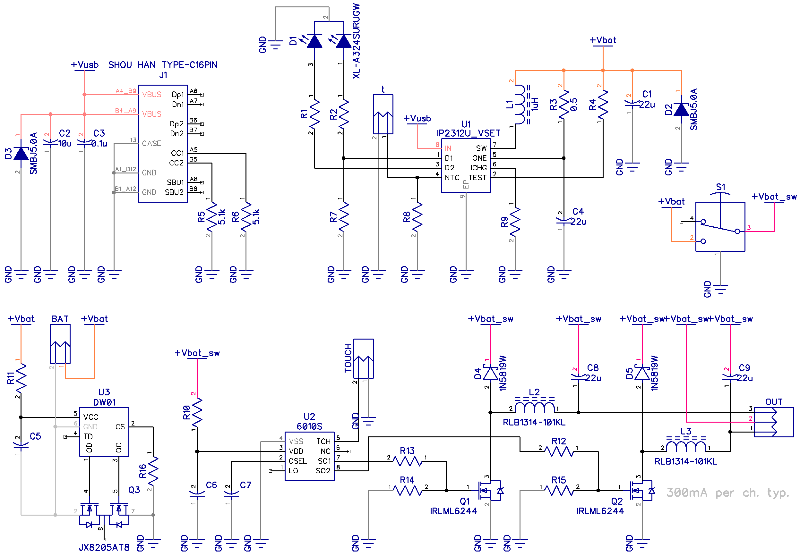

This is PCB for for table lamps with one sensor button and 1S Li-ion battery

Features:
- charge: 1A using type c USB
- protection: DW01 with typical circuit
- out: two PWM channels with LC filter

All parts from LCSC

 
